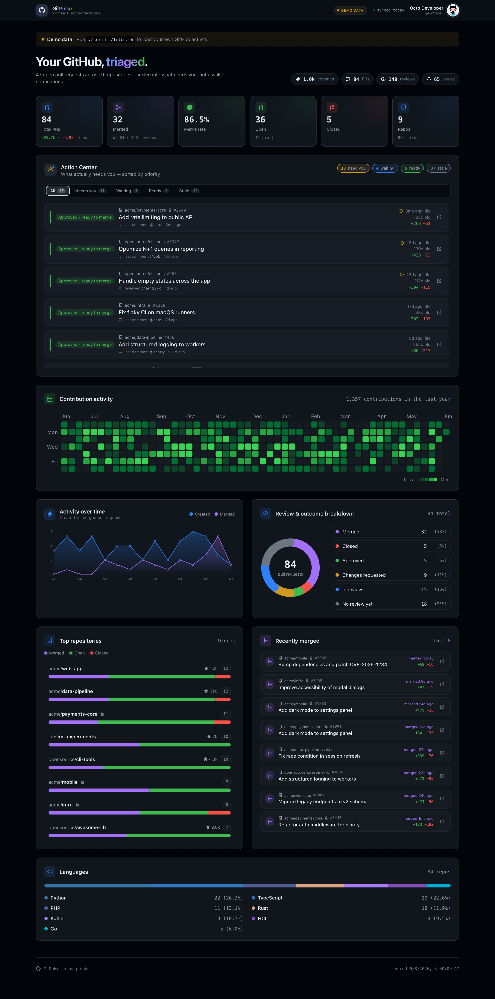
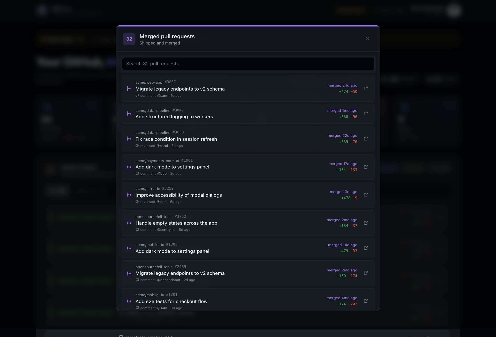

# GitPulse

**An animated GitHub pull-request triage dashboard. Replaces messy GitHub notifications with a prioritized action center.**



Every stat card is clickable - drill into the exact pull requests behind it (mergeable, merged, open, closed) or a per-repository breakdown, with live search:



GitHub notifications are noise. GitPulse pulls *your* PR activity with the `gh` CLI and turns it into one calm, motion-rich view: what needs **you**, what's **waiting on others**, what's **ready to merge**, and what's gone **stale** - plus the analytics (merge rate, contribution heatmap, top repos, languages, activity timeline).

No account data ships in this repo. You run one script locally with your own GitHub auth; the generated data file is gitignored and never leaves your machine. A synthetic demo dataset is committed so a fresh clone renders instantly.

---

## Quick start

```bash
# 1. install
pnpm install            # or: npm install

# 2. load YOUR github activity (uses your gh CLI login)
./scripts/fetch.sh              # current gh account
# ./scripts/fetch.sh octocat    # or any public username

# 3. run
pnpm dev                # http://localhost:3000
```

Without step 2 the app shows the committed **demo** dataset with a banner.

### Requirements
- [GitHub CLI](https://cli.github.com) authenticated: `gh auth login`
- Node 18+
- pnpm (or npm)

---

## How triage works

Each open PR is sorted into one actionable bucket - this is the "notification replacement":

| Bucket | Meaning | Driven by |
| --- | --- | --- |
| **Ready to merge** | Approved, ship it | `reviewDecision == APPROVED` |
| **Needs you** | Changes requested, drafts, or stale | `CHANGES_REQUESTED` / draft / idle ≥ 21d |
| **Waiting on others** | Out for review | `REVIEW_REQUIRED` / no review yet |
| **Stale** | Idle ≥ 21 days | any active PR |

The action feed is ranked by priority, then by how long the PR has sat idle.

---

## Privacy

- `./scripts/fetch.sh` writes **`public/dashboard.json`**, which is **gitignored**.
- Raw API pulls land in **`data/`**, also gitignored.
- Only **`public/demo.json`** (synthetic) is committed.
- Everything runs locally against your own `gh` token. Nothing is uploaded.

---

## Refresh

```bash
pnpm refresh            # re-runs ./scripts/fetch.sh
```

## Deploy

Deploys to any static-friendly host (Vercel, Netlify). The build serves the
committed demo data; for a private deploy with real data, generate
`public/dashboard.json` before building (it will not be committed).

```bash
pnpm build && pnpm start
```

---

## Stack

Next.js 15 (App Router) · React 19 · TypeScript · Tailwind CSS v4 · Motion (Framer Motion) · hand-rolled SVG charts · GitHub Primer-flavored design tokens.

Built with zero runtime dependencies beyond Next + Motion - charts and the
contribution heatmap are custom SVG so every transition is seek-deterministic.
